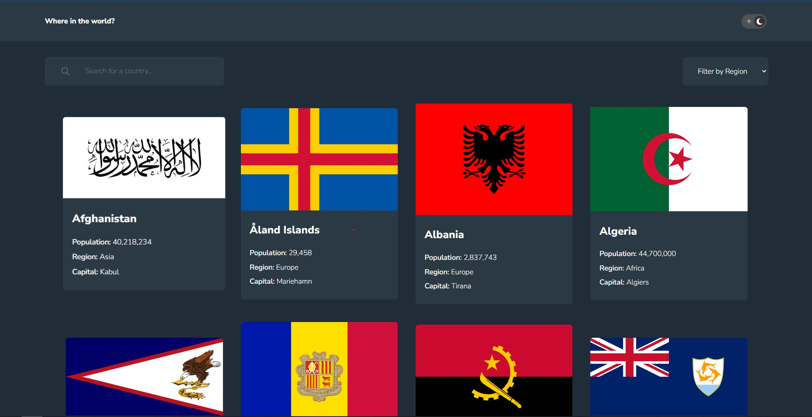
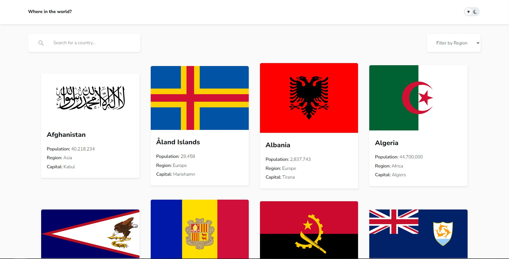

# Frontend Mentor - REST Countries API with color theme switcher solution

This is a solution to the [REST Countries API with color theme switcher challenge on Frontend Mentor](https://www.frontendmentor.io/challenges/rest-countries-api-with-color-theme-switcher-5cacc469fec04111f7b848ca).
## Table of contents

- [Frontend Mentor - REST Countries API with color theme switcher solution](#frontend-mentor---rest-countries-api-with-color-theme-switcher-solution)
  - [Table of contents](#table-of-contents)
  - [Overview](#overview)
    - [The challenge](#the-challenge)
    - [Screenshot](#screenshot)
    - [Links](#links)
  - [My process](#my-process)
    - [Built with](#built-with)
    - [What I learned](#what-i-learned)
  - [Author](#author)


## Overview

### The challenge

Users should be able to:

- See all countries from the API on the homepage
- Search for a country using an `input` field
- Filter countries by region
- Click on a country to see more detailed information on a separate page
- Click through to the border countries on the detail page
- Toggle the color scheme between light and dark mode

### Screenshot

<div align="center">
  
</div>

### Links

- [Solution URL](https://your-solution-url.com)
- [Live Site URL](https://your-live-site-url.com)

## My process

### Built with

- Semantic HTML5 markup
- CSS3
- Flexbox
- CSS Grid
- Mobile-first workflow
- [Vite.js](https://vitejs.dev/)
- [Web components](https://www.webcomponents.org/)


### What I learned

I learned to create and use web components to develop a scalable and reusable web app. Web components are a collection of web platform APIs and technologies that allow developers to create reusable custom elements for web pages and web applications. By using web components, you can encapsulate your code and functionality into small, reusable components that can be easily used and maintained across multiple web pages and applications. This can help to make your code more modular, easier to test, and simpler to maintain and update over time.

I did this using JavaScript only. It looks like this.

```javascript
class WebComponentName extends HTMLElement {
  constructor() {
    super();
    this.attachShadow({ mode: 'open' });
  }
  static get observedAttributes() {
    return ['name', 'price'];
  }
  attributeChangedCallback(attr, oldValue, newValue) {
    if (oldValue !== newValue) {
      this[attr] = newValue;
    }
  }
  getTemplate() {
    const template = document.createElement('template');
    template.innerHTML = `
      <h2>${this.name}</h2>
      <p>${this.price}</p>
      ${this.getStyle()}
    `;
    return template;
  }
  getStyle() {
    return `
      <style>
      
      </style>
    `;
  }
  render() {
    this.shadowRoot.appendChild(this.getTemplate().content.cloneNode(true));
  }
  connectedCallback() {
    this.render();
  }
}
customElements.define('', WebComponentName);

```

## Author

- Website - [Brandon James Huaman](https://www.brandonjj.com)
- Frontend Mentor - [@Brandon328](https://www.frontendmentor.io/profile/Brandon328)
- Twitter - [@BrandonJJ328](https://www.twitter.com/BrandonJJ328)
- Linkedin - [@BrandonJJ](https://www.linkedin.com/in/brandonjj/)
- Github - [@Brandon328](https://github.com/Brandon328)

